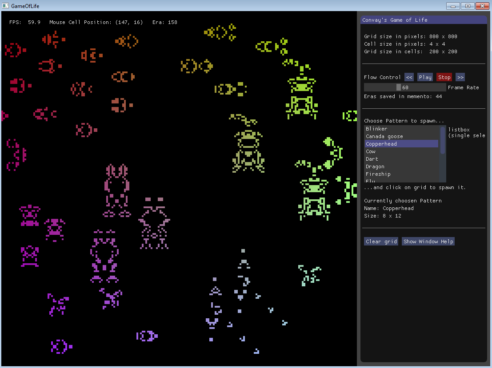

# Adv-Cpp-Uni-Project
**Conway's Game of Life** written in modern C++ (**C++17**)
## Built with
 - [SFML](https://www.sfml-dev.org/)
 - [Dear ImGui](https://github.com/ocornut/imgui) - Bloat-free Immediate Mode Graphical User interface for C++
## Screenshots

 
